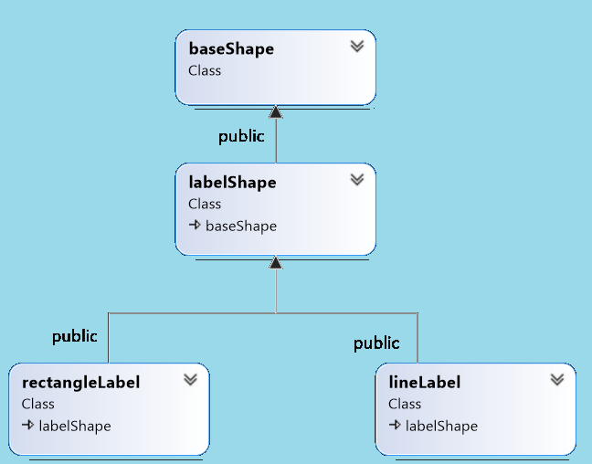

# Workshop #8: Virtual functions and Abstract base classes

In this workshop, you will create a hierarchy of classes to practice and understand the role of virtual functions in inheritance. 
The workshop consists of 4 classes:  
- baseShape; encapsulates a shape that can be drawn on the screen<br />
(An interface, that is an abstract base class with only pure virtual functions)
- labelShape; encapsulates a shape that can be labelled <br />
(An abstract base class that represents a labelled shape) 
- lineLabel; encapsulates a horizontal line on a screen with the label <br />
(this concrete class draws a labelled line)
- rectangleLabel; encapsulates a rectangle on the screen that can be labelled <br />
(this concrete class draws a rectangle with a label inside).


## Learning Outcomes

Upon successful completion of this workshop, you will have demonstrated the abilities to:

- define pure virtual functions
- create abstract base classes
- implement behaviour using virtual functions
- explain the difference between an abstract base class and a concrete class
- describe what you have learned in completing this workshop


## Submission Policy


The workshop is divided into one coding part and one non-coding part:

- Part 1: worth 100% of the workshop's total mark, is due on **Thursday at 23:59:59** of the week of your scheduled lab.
- Part 2 (reflection): non-coding part, is due on **Sunday at 23:59:59** of the week of your scheduled lab. The reflection doesn't have marks associated with it but can incur a **penalty of max 40% of the whole workshop's mark** if your professor deems it insufficient (you make your marks from the code, but you can lose some on the reflection).

**The code that is submitted late receives 0%.**  On Sunday at midnight the submission closes; if the workshop is incomplete when the submission closes (missing at least one of the coding or non-coding parts), **the mark for the entire workshop is 0%**.

Every file that you submit must contain (as a comment) at the top **your name**, **your Seneca email**, **Seneca Employee ID** and the **date** when you completed the work.

If the file contains only your work or work provided to you by your professor, add the following message as a comment at the top of the file:

> I have done all the coding by myself and only copied the code that my professor provided to complete my workshops and assignments.


If the file contains work that is not yours (you found it online or somebody provided it to you), **write exactly which part of the assignment is given to you as help, who gave it to you, or which source you received it from.**  By doing this you will only lose the price for the parts you got help for, and the person helping you will be clear of any wrongdoing.


## Compiling and Testing Your Program

All your code should be compiled using this command on `matrix`:

```bash
g++ -Wall -std=c++11 -g -o ws file1.cpp file2.cpp ...
```

- `-Wall`: compiler will report all warnings
- `-std=c++11`: the code will be compiled using the C++11 standard
- `-g`: the executable file will contain debugging symbols, allowing *valgrind* to create better reports
- `-o ws`: the compiled application will be named `ws`

After compiling and testing your code, run your program as following to check for possible memory leaks (assuming your executable name is `ws`):

```bash
valgrind ws
```

To check the output, use a program that can compare text files.  Search online for such a program for your platform, or use *diff* available on `matrix`.

> Note: All the code written in workshops and the project must be implemented in the **sdds** namespace.

# PART 1 (100%)

Implement four modules for the following classes; **baseShape, labelShape, lineLabel** and **rectangleLabel**




## 1- The `baseShape` interface

### Create the following two [Pure virtual functions](https://ict.senecacollege.ca/~oop244/pages/content/abstr.html#pur):
> a [pure virtual function](https://ict.senecacollege.ca/~oop244/pages/content/abstr.html#pur) is a virtual function that has no implementation.  To indicate that the pure virtual function does not have implementation set its prototype to zero (```= 0;```) in the class declaration.

#### drawShape  
Returns void and receives a reference to **ostream** as an argument.  This pure virtual function can not modify the current object.

#### readShape
Returns void and receives a reference to **istream** as an argument. 

### `destructor`
Create a virtual empty destructor for the baseShape interface. 
> this guarantees that any dynamically allocated derived class from the baseShape interface pointed by a base class pointer will be removed properly from memory when deleted.

### `baseShape` helper functions
Overload the insertion and extraction operators (using drawShape and readShape functions) so any shape object can be written or read using ostream and istream.


## 2- The `labelShape` abstract Class (the Labeled Shape class)
Inherit an abstract class from the interface `baseShape` called `labelShape`.  This class adds a label to a `baseShape`.

This class will implement the pure virtual function **readShape** but will not implement the drawShape function; therefore it remains abstract.

### Private Member variable
Add a character pointer member variable called **m_label** and initialize it to null.  This member variable will be used to hold the dynamically allocated label for the `baseShape`.


### Protected members 
#### ``` label() ```
Add a query called **label** that returns the unmodifiable value of m_label member variable. 

### public members
#### Default (no argument) constructor
Sets the label pointer to null. (You don't need to do this if the **m_label** is already initialized to null)
#### One argument constructor
Allocates memory large enough to hold the incoming Cstring argument pointed by the **m_label** member variable.  Then copies the Cstring argument to the newly allocated memory.
#### Destructor
Deletes the memory pointed by **m_label** member variable.
#### deleted actions
The copy constructor and assignment operator are deleted to prevent copying or assignment of instances of this class.
#### readShape
Reads a comma-delimited Cstring form istream: <br /> 
Override the **baseShape::readShape** pure virtual function to receive a Cstring (a label) from **istream** up to the **','** character (and then extract and ignore the **comma**).  Afterward, follow the same logic as was done in the one argument constructor; allocate memory large enough to hold the Cstring and copy the Cstring into the newly allocated memory. 

## 3- The `lineLabel` concrete class
lineLabel inherits the **labelShape** class to create a horizontal line with a label.

### Private Member variable
Create a member variable called **m_length** to hold the length of the **lineLabel** in characters.

#### Default (no argument) constructor
Sets the **m_length** member variable to zero, and invokes the default constructor of the base class. 
#### Two argument constructor
Receives a Cstring and a value for the length of the line.  Passes the Cstring to the constructor of the base class and sets the **m_length** member variable to the value of the second argument.

#### Destructor
This class has no destructor implemented.

#### readShape
Reads comma-separated specs of the **lineLabel** from istream.<br />
This function overrides the **readShape** function of the base class as follows.<br />
First, it will call the **readShape** function of the base class then it will read the value of the m_length attribute from the istream argument, and then it will ignore The rest of the characters up to and including the newline character **'\n'**.

#### drawShape
This function overrides the drawShape function of the base class.<br />
If the **m_length** member variable is greater than zero and the **label()** is not null, this function will first print the **label()** and then go to the new line.  Afterwards it keeps printing the **'='** (assignment character) to the value of the **m_length** member variable.<br />
Otherwise, it will take no action.

For example, if the Cstring returned by the label query is "Separator" and the length is 40, the drawShape function should insert the following into ostream:

```Text
Separator
========================================
```
## 4- The `rectangleLabel` concrete class
The rectangleLabel class inherits the **labelShape** class to create a frame with a label inside.

### Private Member variable
Create two member variables called **m_width** and **m_spaces** to hold the width of a rectangular frame (number of characters) and the number of spaces between the boundary of the rectangle and the first character of the label.

#### Default (no argument) constructor
Sets the width and number of spaces member variables to zero.  It will also invoke the default constructor of the base class.

#### Three argument constructor
Receives a Cstring for the label, and two values for the width and number of spaces of the **rectangleLabel** from the argument list.  Passes the Cstring to the constructor of the base class and sets the **m_width** and **m_spaces** member variables to the corresponding values received from the argument list.
However if the **m_width** is enough for **m_spaces** and **label()** with the two side vertical lines, it will set the rectangleLabel to an empty state (set **m_width** to 0 and use it before you start drawing)

#### Destructor
This class has no destructor implemented.

#### readShape
Reads comma-separated specs of the **rectangleLabel** from istream.<br />
This function overrides the **readShape** function of the base class as follows.<br />
First, it will call the **readShape** function of the base class, then it will read two comma-separated values from istream for **m_width** and **m_length** and then ignores the rest of the characters up to and including the newline character (**'\n'**).

#### drawShape
This function overrides the drawShape function of the base class.<br />
If the rectangleLabel is not in an empty state, this function will drawShape a rectangle with a label inside as follows, otherwise, it will do nothing:

First line:<br />
prints '+', then prints the '-' character (m_width - 2) times and then prints '+' and goes to newline.

Second line:<br />
prints '|', then m_spaces empty spaces,
and then in the smae line within (m_width-m_spaces) spaces it prints the **label()** left justified and then prints '|' and goes to new line.

Last line: <b />
exactly like first line.

For example, if the Cstring returned by the label query is "Container", the width is 30 and the number of spaces is 5, this function should insert the following into ostream:

```Text
+----------------------------+
|     Container              |
+----------------------------+
```


## `main` Module (supplied)

**Do not modify this module!**  Walk through the code and make sure you understand it.

### Sample Output

```Text
Nothing should be printed between these two lines
------------------------------------
------------------------------------

Two simple shapes should be printed here
(Separator label with a line of width 50 and then Container label with width 20 and leading spaces 5):

Separator
==================================================

+------------------+
|     Container    |
+------------------+


To test creating a line shape, enter the following:
>lineLabel two,40<ETNER>
>lineLabel two,40
The following outputs should be the same
The correct output:
lineLabel two
========================================
Your output:
lineLabel two
========================================

To test creating a rectangle shape, enter the following:
>A 55 frame with 4 space to be printed on screen,55,4<ETNER>
>A 55 frame with 4 space to be printed on screen,55,4
The following outputs should be the same
The correct output:
+-----------------------------------------------------+
|    A 55 frame with 4 spaces to be printed on screen |
+-----------------------------------------------------+
Your output:
+-----------------------------------------------------+
|    A 55 frame with 4 space to be printed on screen  |
+-----------------------------------------------------+
printing lineLabel and rectangleLabel using Shape pointers:
lineLabel two
========================================
+-----------------------------------------------------+
|    A 55 frame with 4 space to be printed on screen  |
+-----------------------------------------------------+
Reading the data from a file
line one
==========
line two
==============================
line three
==================================================
line four
======================================================================
+-------------+
|    Step four|
+-------------+
+-----------------------+
|   Step three          |
+-----------------------+
+---------------------------------+
|  Step two                       |
+---------------------------------+
+-------------------------------------------+
| Step one                                  |
+-------------------------------------------+

```


## Files to submit
```Text
baseShape.h
baseShape.cpp
labelShape.h
labelShape.cpp
lineLabel.h
lineLabel.cpp
rectangleLabel.h
rectangleLabel.cpp
main.cpp
```

## PART 1 Submission 
To test and demonstrate the execution of your program use the same data as shown in the output example.

Upload your source code and data file to your `matrix` account. Compile and run your code using the `g++` compiler as shown above and make sure that everything works properly.

Then, run the following command from your account
- replace `profname.proflastname` with your professor’s Seneca userid
- replace **??** with your subject code (2**00** or 2**44**)
- replace **#** with the workshop number
- replace **X** with the workshop part number (**1** or **2**) 
```text
~profname.proflastname/submit 2??/w#/pX
```

and follow the instructions.

> **⚠️Important:** Please note that a successful submission does not guarantee full credit for this workshop. If the professor is not satisfied with your implementation, your professor may ask you to resubmit. Re-submissions will attract a penalty.


# Part 2: Reflection

Study your final solutions for each deliverable of the workshop **and the most recent milestones of the project**, reread the related parts of the course notes, and make sure that you have understood the concepts covered by this workshop.  **This should take no less than 30 minutes of your time and the result is suggested to be at least 150 words in length.**

Create a file named `reflect.txt` that contains your detailed description of the topics that you have learned in completing this workshop and **the project milestones** and mention any issues that caused you difficulty.


## Reflection Submission (part 2)


Upload the **reflect.txt** to your `matrix` account. 

Then, run the following command from your account
- replace `profname.proflastname` with your professor’s Seneca userid
- replace **??** with your subject code (2**00** or 2**44**)
- replace **#** with the workshop number
- replace **X** with the workshop part number (**1** or **2**) 
```text
~profname.proflastname/submit 2??/w#/pX
```

and follow the instructions.

> **⚠️Important:** Please note that a successful submission does not guarantee full credit for this workshop. If the professor is not satisfied with your implementation, your professor may ask you to resubmit. Re-submissions will attract a penalty.
